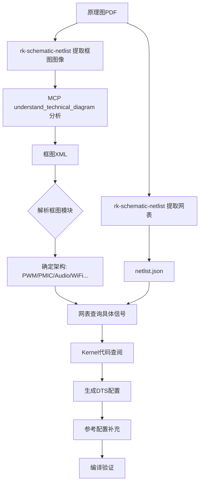

# 原理图 → DTS 生成技能

根据原理图**框图**和**网表**生成 Rockchip 平台的 DTS 配置。

## 1. 核心原则

> [!IMPORTANT]
> **框图优先**：先读取框图XML获取系统级硬件模块和连接关系，再用网表获取具体信号细节。

**核心流程**：
1. **框图分析** → 确定硬件架构（电源方案、音频方案、网络方案等）
2. **网表细节** → 获取具体GPIO编号、Pinctrl复用选择
3. **代码查阅** → 动态确认Kernel中的节点名称
4. **生成DTS** → 映射生成配置

---

## 2. 前置依赖

使用 `rk-schematic-netlist` 技能提取框图和网表：

```bash
# 1. 提取框图图像
python3 /path/to/rk-schematic-netlist/scripts/extract_block_diagrams.py --input /path/to/schematic.pdf

# 2. 使用 MCP understand_technical_diagram 工具分析框图 → 输出 XML

# 3. 提取网表
python3 /path/to/rk-schematic-netlist/scripts/extract_netlist.py --input /path/to/schematic.pdf --output ./netlist.json
```

---

## 3. 第一步：框图分析 (Block Diagram Analysis)

**目的**：从框图XML获取系统级设计意图。

### 3.1 框图XML结构

```xml
<Diagram>
  <Mod name="Discrete Power BUCK&LDO" cat="Power">
    <In sig="PWM0_CH2_M0_LOGIC" path="RK3538->Discrete Power" type="Control"/>
    <In sig="PWM0_CH3_M1_CPU" path="RK3538->Discrete Power" type="Control"/>
  </Mod>
  <Mod name="RK730" cat="Audio">
    <Out sig="I2C2_M2" path="RK730->RK3538" type="Control"/>
    <Out sig="SAI1_M0" path="RK730->RK3538" type="Audio Data"/>
  </Mod>
</Diagram>
```

### 3.2 框图模块 → 架构判断

| 框图模块 | cat属性 | 关键信号 | 架构判断 | DTS节点 |
|---------|---------|----------|---------|---------|
| `Discrete Power BUCK&LDO` | Power | `PWM*_CH*_*` | **PWM电源方案** | `pwm-regulator` |
| `PMIC` 或 `RK8xx` | Power | `PMIC_*` | **PMIC方案** | `rk8xx` i2c节点 |
| `RK730` | Audio | `I2C*_M*`, `SAI*_M*` | 外部Codec | `rk730` codec节点 |
| `WIFI 6` / `WiFi` | Wireless | `SDIO`, `UART*_M*` | WiFi+BT | `&sdio`, `sdio_pwrseq` |
| `Giga PHY` | Network | `ETH*`, `MDI` | 千兆以太网 | `&gmac`, phy节点 |
| `HDMI2.0 TX` | Display | `HDMI TMDS` | HDMI输出 | `&hdmi` |
| `RTC IC` | Real-Time Clock | `I2C*_M*`, `INT` | 外部RTC | rtc设备节点 |

### 3.3 解析步骤

1. **读取框图XML文件**
2. **遍历 `<Mod>` 元素**，提取 `name` 和 `cat` 属性
3. **根据 `cat` 分类确定子系统**
4. **提取 `sig` 属性获取具体信号名**（如 `I2C2_M2`）

---

## 4. 第二步：网表细节 (Netlist Details)

**目的**：从网表获取具体GPIO编号和信号连接。

### 4.1 从框图信号到网表查询

框图给出信号名（如 `I2C2_M2`），需在网表中查找：
- 具体GPIO编号（如 `GPIO0_D4`）
- 连接的组件（如 `U100`）

### 4.2 网表查询策略

```python
# 伪代码：在网表中搜索信号
def find_gpio_for_signal(netlist, signal_pattern):
    # signal_pattern 如 "WIFI_REG_ON"
    for net_name, locations in netlist["nets"].items():
        if signal_pattern in net_name:
            # 检查是否有GPIO前缀
            if "GPIO" in net_name:
                return parse_gpio(net_name)  # 如 GPIO0_D0 -> <&gpio0 RK_PD0>
    return None
```

### 4.3 GPIO编号转换

| 网表内容 | DTS 映射 |
|----------|----------|
| `GPIO0_D4` | `<&gpio0 RK_PD4 ...>` |
| `GPIO1_A2` | `<&gpio1 RK_PA2 ...>` |
| `_H` 后缀 | `GPIO_ACTIVE_HIGH` |
| `_L` 后缀 | `GPIO_ACTIVE_LOW` |

---

## 5. 第三步：动态查阅 Kernel 代码

> [!CAUTION]
> **不要硬编码节点名！** 必须查阅当前 Kernel 源码确认。

### 5.1 查阅 Pinctrl 定义

```bash
# 搜索 I2C2 的 M2 复用定义
grep -n "i2c2m2" arch/arm64/boot/dts/rockchip/rk35xx-pinctrl.dtsi
```

### 5.2 查阅参考板配置

```bash
# 查看已有 EVB 配置作为参考
cat arch/arm64/boot/dts/rockchip/rk3538-evb.dtsi
```

---

## 6. 第四步：生成 DTS 配置

> [!IMPORTANT]
> **不要硬编码模板**！每个原理图的外设不同，应动态检索参考配置。

### 6.1 框图模块 → DTS节点映射方法

根据框图 `<Mod>` 的 `cat` 属性，确定对应的 DTS 节点类型：

| 框图 `cat` | 常见模块名 | DTS 节点类型 | 检索命令 |
|-----------|-----------|-------------|---------|
| `Power` | Discrete Power, PMIC | regulator节点 | `grep -r "pwm-regulator\|rockchip,rk8" *.dtsi` |
| `Audio` | RK730, ES8388, ACODEC | codec/sound节点 | `grep -r "<模块名>" *.dtsi` |
| `Wireless` | WIFI, BT | sdio_pwrseq, wlan-platdata | `grep -r "wlan-platdata" *.dtsi` |
| `Network` | PHY, Ethernet | gmac, mdio节点 | `grep -r "phy-mode" *.dtsi` |
| `Display` | HDMI, MIPI | hdmi, dsi节点 | `grep -r "&hdmi" *.dtsi` |
| `USB` | USB HOST/DRD | usb2phy, dwc3节点 | `grep -r "usb_drd" *.dtsi` |
| `Storage` | eMMC, SD | sdhci, sdmmc节点 | `grep -r "&sdhci\|&sdmmc" *.dtsi` |

### 6.2 通用生成流程

对每个框图模块，执行以下步骤：

```bash
# 1. 识别模块类型（从框图XML的cat属性）
#    例如: <Mod name="RK730" cat="Audio">

# 2. 搜索同SoC的参考配置
grep -rn "RK730\|rk730" arch/arm64/boot/dts/rockchip/rk3538*.dtsi

# 3. 如果无结果，扩大搜索范围到其他SoC
grep -rn "rk730" arch/arm64/boot/dts/rockchip/*.dtsi | head -5

# 4. 查看找到的参考配置
view_file <找到的文件>:<行号>
```

### 6.3 信号到Pinctrl映射

从框图的 `sig` 属性提取信号名，查找对应的pinctrl：

```bash
# 框图信号: I2C2_M2 -> 搜索 pinctrl
grep "i2c2m2" arch/arm64/boot/dts/rockchip/rk3538-pinctrl.dtsi

# 框图信号: SAI1_M0 -> 搜索 pinctrl  
grep "sai1m0" arch/arm64/boot/dts/rockchip/rk3538-pinctrl.dtsi
```

### 6.4 GPIO信号处理

从网表中提取GPIO编号：

```bash
# 在网表中搜索信号（如 WIFI_REG_ON）
grep "WIFI_REG_ON\|GPIO.*WIFI" netlist.json

# 转换规则: GPIO<bank>_<group><num> -> <&gpio<bank> RK_P<group><num>>
# 示例: GPIO0_D0 -> <&gpio0 RK_PD0 ...>
```

### 6.5 节点状态使能

对框图中存在的模块，需要使能对应节点：

```dts
/* 通用模式：引用SoC dtsi中定义的节点并使能 */
&<节点名> {
    status = "okay";
    /* 根据参考配置补充其他属性 */
};
```

---

## 7. 参考配置检索 (补充无法从框图获取的信息)

> [!WARNING]
> **框图和网表无法提供所有信息**。以下参数需要从参考配置或硬件工程师获取。

### 7.1 无法自动生成的参数

| 参数类型 | 示例 | 获取方式 |
|---------|------|---------|
| **时序参数** | `pre-power-on-delay-ms`, `post-power-down-delay-ms` | 参考同芯片EVB配置 |
| **调优参数** | `tx_delay`, `rx_delay` | PHY datasheet 或参考板 |
| **PHY特定信息** | `reset-delays-us` (RTL8211F需100ms) | PHY型号文档 |
| **音频路由** | `audio-routing` 的详细连接 | Codec datasheet |

### 7.2 参考配置检索策略

1. **同SoC参考板**：
   ```bash
   # 搜索同芯片的EVB配置
   ls arch/arm64/boot/dts/rockchip/rk3538*evb*.dtsi
   
   # 查看已有配置中的特定节点
   grep -A 20 "rk730_sound:" arch/arm64/boot/dts/rockchip/rk3538-evb*.dtsi
   ```

2. **同外设不同平台**：
   ```bash
   # 如果使用 AP6275S WiFi，搜索其他平台的配置
   grep -r "ap6275s" arch/arm64/boot/dts/rockchip/
   
   # 如果使用 RTL8211F PHY
   grep -r "rtl8211" arch/arm64/boot/dts/rockchip/*.dtsi
   ```

3. **驱动文档**：
   ```bash
   # 查看驱动的 binding 文档
   ls Documentation/devicetree/bindings/net/
   cat Documentation/devicetree/bindings/sound/rockchip,rk730.yaml
   ```

### 7.3 生成后的手动检查项

生成DTS后，**必须检查**以下内容并从参考补充：

- [ ] **delay 参数**: `*-delay-ms`, `*-delay-us`
- [ ] **调优参数**: `tx_delay`, `rx_delay`, `sample-phase`
- [ ] **音频节点**: `audio-routing` 连接关系
- [ ] **PHY配置**: `reset-delays-us` 需根据具体PHY型号调整

---

## 8. 验证清单

- [ ] **框图模块** → 对应DTS节点是否齐全？
- [ ] **Pinctrl引用** → 是否在 `pinctrl.dtsi` 中真实存在？
- [ ] **GPIO编号** → 是否正确转换？(`RK_PA/PB/PC/PD` = `0/8/16/24`)
- [ ] **信号复用** → `_M0/_M1/_M2` 是否与实际连接一致？
- [ ] **参考补充** → 是否从参考配置补充了 delay/调优参数？

---

## 9. 完整工作流示例



